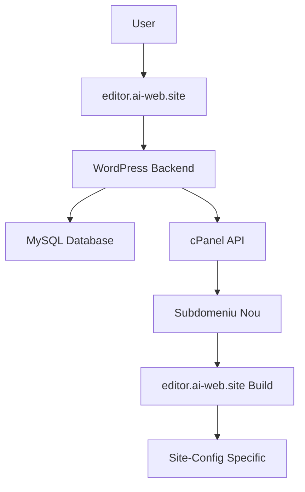

# Arhitectura AI Live Website Builder

## 🏗️ Overview

Aplicația folosește o arhitectură separată backend/frontend cu WordPress ca backend și React.js ca frontend.

## 🔄 Fluxul de Date



## 🏢 Componente Principale

### 1. Frontend (React.js)
- **Locația**: `frontend/`
- **URL**: `editor.ai-web.site`
- **Responsabilități**:
  - Interfața de editare
  - Preview în timp real
  - Comunicare cu WordPress API
  - Build static pentru toate subdomeniile

### 2. Backend (WordPress)
- **Locația**: `backend/wordpress/`
- **URL**: `ai-web.site`
- **Responsabilități**:
  - Gestionare utilizatori
  - Stocare configurații site
  - Administrare subdomenii
  - API REST pentru frontend

### 3. API Services (PHP)
- **Locația**: `backend/api/`
- **Responsabilități**:
  - Servicii AI (Gemini, Unsplash)
  - Proxy pentru API-uri externe
  - Configurații securizate

### 4. Shared Resources
- **Locația**: `shared/`
- **Responsabilități**:
  - Constante comune
  - Tipuri TypeScript
  - Utilități partajate

## 🌐 Gestionarea Subdomeniilor

### Workflow Creare Subdomeniu

```
1. User request → WordPress Admin
2. WordPress → cPanel API call
3. cPanel creates subdomain
4. Subdomain points to editor.ai-web.site
5. Site-config stored in WordPress DB
6. Subdomain serves custom config
```

### Structura Subdomeniilor

```
subdom1.ai-web.site → editor.ai-web.site
subdom2.ai-web.site → editor.ai-web.site
subdom3.ai-web.site → editor.ai-web.site
```

**Toate subdomeniile:**
- Folosesc același build ReactJS
- Încarcă configurații diferite din WordPress
- Afișează site-uri complet diferite

## 🔐 Securitate

### Autentificare
- WordPress sessions pentru admin
- JWT tokens pentru API calls
- Rate limiting pe endpoint-uri

### API Keys Management
- Toate cheile API în `backend/config/constants.php`
- Nu sunt expuse în frontend
- Proxy prin servicii PHP

### Data Validation
- Input sanitization în WordPress
- Type validation în TypeScript
- SQL injection prevention

## 📊 Baza de Date

### WordPress Tables
```sql
-- Plugin-ul adaugă
wp_ai_web_sites (
    id, user_id, subdomain, domain,
    site_config, created_at, updated_at, status
)
```

### Site Config Structure
```json
{
  "metadata": { "version": "2.0.0" },
  "sectionOrder": ["header", "hero", "about"],
  "sections": { ... },
  "theme": { ... },
  "seo": { ... }
}
```

## 🔄 API Endpoints

### WordPress REST API
```
GET  /wp-json/ai-web-site/v1/site-config?subdomain=xxx
POST /wp-json/ai-web-site/v1/site-config
PUT  /wp-json/ai-web-site/v1/site-config/{id}
DELETE /wp-json/ai-web-site/v1/site-config/{id}
```

### PHP API Services
```
POST /api/ai-service.php          # AI text/image generation
GET  /wp-json/ai-web-site/v1/website-config/{domain}  # Site config by domain
```

## 🚀 Deployment Strategy

### Production Setup
```
ai-web.site/                     # WordPress backend
├── wp-content/plugins/ai-web-site/
├── api/                         # PHP services
└── wp-config.php

editor.ai-web.site/              # React frontend
├── index.html                   # Build static
├── assets/
└── ...

subdom1.ai-web.site → editor.ai-web.site
subdom2.ai-web.site → editor.ai-web.site
```

### Development Workflow
1. Dezvoltare în `frontend/` și `backend/`
2. Test local cu WordPress local
3. Build frontend: `npm run build`
4. Deploy WordPress + API în root
5. Deploy frontend build în `editor.ai-web.site`

## 📈 Scalabilitate

### Performance
- Un singur build pentru toate subdomeniile
- CDN pentru assets statice
- Database query optimization
- Caching la nivel WordPress

### Maintenance
- Actualizări centralizate ale build-ului
- WordPress plugin updates
- Monitoring subdomain health
- Backup automatizat

## 🔧 Development Guidelines

### Frontend Development
- Lucrează în `frontend/src/`
- Folosește TypeScript strict
- Testează cu build local
- Respectă structura componentelor

### Backend Development
- Extinde plugin-ul WordPress
- Folosește WordPress hooks
- Validează toate input-urile
- Respectă WordPress coding standards

### API Development
- Adaugă endpoint-uri în `backend/api/`
- Implementează rate limiting
- Documentează toate API-urile
- Testează cu Postman/curl
